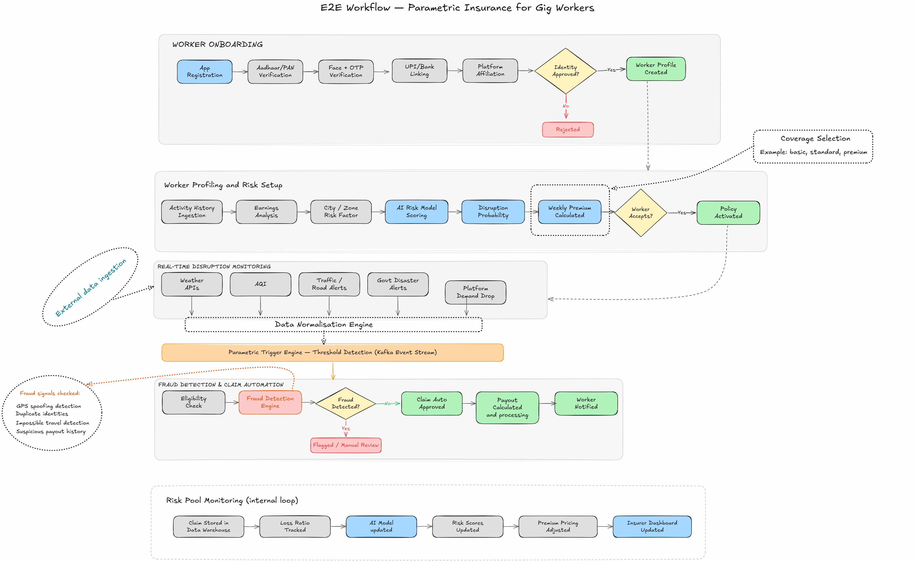

# Myrva

**AI-Powered Parametric Income Insurance for India's Gig Workers**

Myrva is a parametric insurance platform built for platform-based gig workers (Swiggy / Zomato delivery partners) in India. It provides automated, trigger-based income protection against external disruptions — extreme weather, hazardous air quality, and government-declared disasters — with no manual claims process and weekly pricing aligned to the gig work earnings cycle.

---

## Table of Contents
- [Problem Understanding](#problem-understanding)
- [Architecture Overview](#architecture-overview)
- [End-to-End Workflow](#end-to-end-workflow)
  - [Worker Onboarding](#1-worker-onboarding)
  - [Worker Profiling and Risk Setup](#2-worker-profiling-and-risk-setup)
  - [Real-Time Disruption Monitoring](#3-real-time-disruption-monitoring)
  - [Fraud Detection and Claim Automation](#4-fraud-detection-and-claim-automation)
  - [Risk Pool Monitoring](#5-risk-pool-monitoring-internal-loop)
- [Tech Stack](#tech-stack)
- [Data Architecture](#data-architecture)
- [Development Plan](#development-plan) 
- [AI and ML Models](#ai-and-ml-models)

---

## Problem Understanding

A delivery worker’s job looks flexible on the surface, but their income is tightly coupled to conditions they don’t control. They don’t earn a fixed salary - they earn only when they are able to stay online, accept orders, and complete deliveries. That means their weekly income is not just variable, it is fragile.

Workers often plan expenses assuming steady daily income, but external factors like bad weather, pollution, or local restrictions can suddenly reduce or eliminate their ability to work. The real issue is not a single lost day, but the cumulative impact losing multiple days in a week directly affects essentials like fuel, rent, and food, with no safety net in place. 

Traditional insurance systems fail to address this because there is no physical damage or injury to claim, making the loss invisible to insurers but immediate and critical for the worker.

This creates a clear gap. Gig workers are exposed to frequent, external disruptions that reduce their income, but there is no system that recognizes or compensates for these events. Any solution that depends on manual claims or delayed processing will fail, because the impact is immediate and short-term.

The core problem, therefore, is not the absence of insurance in general. It is the absence of a system that can identify when a worker’s earning capacity is disrupted by external conditions and compensate that loss quickly and automatically.
This is fundamentally a problem of detecting income disruption in real time and responding to it without friction.

---

## Architecture Overview


The system is composed of the following logical layers:

| Component | Responsibility |
|---|---|
| API Gateway | Routing, JWT auth, rate limiting |
| Identity Service | Aadhaar/PAN/OTP verification, face + device verification |
| Worker Profile Service | City, zone, platform, activity signals |
| Policy Service | Coverage activation, weekly premium calculation, risk pool booking |
| Worker Activity & Earnings Service | Delivery counts, hours online, weekly baseline income (via platform API) |
| Data Ingestion & Normalisation Layer | External feed aggregation and normalisation |
| Parametric Trigger Engine | Zone-level threshold evaluation, Kafka event publishing |
| Claim Engine | Eligibility check, policy validation, payout calculation |
| Fraud Detection Service | GPS spoof detection, biometric identity checks |
| AI Risk Engine | Risk scoring (XGBoost), premium pricing (LightGBM), disruption forecasting, fraud anomaly detection |
| Feature Store (Redis) | Low-latency access to risk scores, earnings features, weather signals, location data |
| Payment Service | Razorpay / UPI payout execution |
| Notification Service | FCM push, SMS, WhatsApp delivery |
| Risk Pool Service | Premium and payout tracking, loss ratio calculation |
| Data Lake (S3) | Weather history, claim history, earnings logs for model training |

---

## End-to-End Workflow



### 1. Worker Onboarding

```
App Registration
  → Aadhaar / PAN Verification
  → Face + OTP Verification
  → UPI / Bank Linking
  → Platform Affiliation (Swiggy / Zomato)
  → Identity Approved?
      Yes → Worker Profile Created → Coverage Selection (Basic / Standard / Premium)
      No  → Rejected
```

Workers register through the mobile app, undergo KYC via Aadhaar/PAN and biometric face verification, link their payout account, and affirm their platform affiliation. Approved workers proceed to select a coverage tier.

### 2. Worker Profiling and Risk Setup

```
Activity History Ingestion
  → Earnings Analysis
  → City / Zone Risk Factor
  → AI Risk Model Scoring
  → Disruption Probability Calculation
  → Weekly Premium Calculated
  → Worker Accepts?
      Yes → Policy Activated
      No  → (exit)
```

The AI Risk Engine ingests historical delivery activity and earnings data, applies city and zone-level risk factors, and scores each worker using ML models. The output is a personalised weekly premium. Upon acceptance, the policy is activated.

### 3. Real-Time Disruption Monitoring

```
External Data Sources (ingested continuously):
  - Weather APIs (IMD)
  - AQI (CPCB)
  - Traffic / Road Alerts
  - Government Disaster Alerts (NDMA)
  - Platform Demand Drop (Swiggy / Zomato feed)

  → Data Normalisation Engine
  → Parametric Trigger Engine — Threshold Detection via Kafka Event Stream

Trigger thresholds (examples):
  - Rainfall > 60mm in 24h
  - AQI > 300 (Hazardous)
  - Curfew / Heatwave declared
```

When a disruption threshold is breached in a zone, a `DisruptionEvent` is published to the Kafka event bus. The time-series data (weather readings, AQI, GPS logs, zone trigger history) is stored in TimescaleDB for audit and model training.

### 4. Fraud Detection and Claim Automation

```
Disruption Event Detected
  → Eligibility Check (policy active, worker in affected zone)
  → Fraud Detection Engine
      Fraud Detected?
          Yes → Flagged / Manual Review
          No  → Claim Auto Approved
                → Payout Calculated
                → Payment via Razorpay / UPI
                → Worker Notified (FCM / SMS / WhatsApp)
```

**Fraud signals evaluated:**
- GPS spoofing detection
- Duplicate identity patterns
- Impossible travel detection
- Suspicious payout history

All claim records (claimId, workerId, policyId, status, timestamp) are persisted in MongoDB.

### 5. Risk Pool Monitoring (Internal Loop)

```
Claim Stored in Data Warehouse (S3)
  → Loss Ratio Tracked
  → AI Model Updated
  → Risk Scores Updated
  → Premium Pricing Adjusted
  → Insurer Dashboard Updated
```

The Risk Pool Service continuously tracks the ratio of premiums collected to claims paid. This data flows back into the AI Risk Engine to recalibrate risk scores, update disruption probability models, and adjust future premium pricing — forming a closed feedback loop.

---

## Tech Stack


**Databases**

| Store | Purpose |
|---|---|
| PostgreSQL | Worker profiles, policy records, identity data |
| TimescaleDB (PostgreSQL extension) | Time-series storage for weather readings, AQI, GPS logs, zone trigger history |
| PostGIS (PostgreSQL extension) | Geospatial queries — zone-based eligibility, GPS validation |
| MongoDB | Worker activity logs, claim records |
| Redis (Feature Store) | Real-time ML feature serving — risk scores, earnings data, weather features, location signals |
 
- Chose React Native to enable real-time, location-aware interactions (GPS, notifications) and provide a more reliable, performant experience for workers compared to a web app.

---

## Data Architecture

**PostgreSQL (Worker — Policy)**

| Field | Description |
|---|---|
| workerId | Unique worker identifier |
| name | Worker name |
| city, zone | Geographic assignment |
| platformId | Swiggy / Zomato worker ID |
| policyId | Active policy reference |
| weeklyPremium | Current week's premium amount |
| coverageStatus | Active / inactive / suspended |
| locationData | PostGIS-enabled coordinates |

**MongoDB (User Activity)**

| Field | Description |
|---|---|
| claimId | Unique claim identifier |
| workerId | Worker reference |
| policyId | Policy reference |
| triggerId | Disruption trigger that caused the event |
| deliveries | Delivery count in period |
| hours | Active hours in period |
| dailyEarnings | Day-level earnings records |
| weeklyAvg | Computed weekly average earnings |
| status | Processing status |

**MongoDB (Claim)**

| Field | Description |
|---|---|
| claimId | Unique claim identifier |
| workerId | Worker reference |
| policyId | Policy reference |
| amount | Payout amount |
| status | Approved / flagged / paid |
| timestamp | Event and processing timestamps |

**TimescaleDB**

Stores continuous time-series data: weather readings, AQI measurements, GPS event logs, and zone-level trigger history — enabling both real-time threshold detection and retrospective audit.

---

## Development Plan

The Development Plan is Linked to [Development Plan](./TODO.md)

## AI and ML Models

| Model | Algorithm | Purpose |
|---|---|---|
| Risk Scoring | XGBoost | Predict individual worker risk based on zone, history, and platform activity |
| Premium Pricing | LightGBM | Dynamic weekly premium computation per worker profile |
| Disruption Forecasting | Time-series / regression | Forward-looking disruption probability for premium adjustment |
| Fraud Anomaly Detection | Isolation Forest / ensemble | Identify anomalous claim patterns before payout approval |

All models are served via the AI Risk Engine, which reads features from the Redis Feature Store and writes updated scores back for downstream consumption by the Policy and Claim services.

