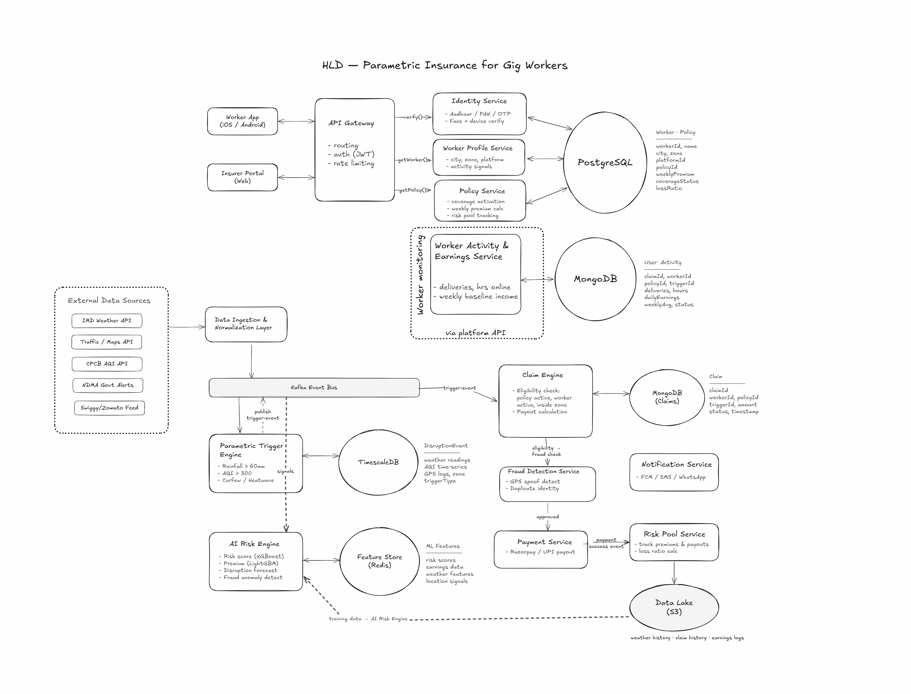
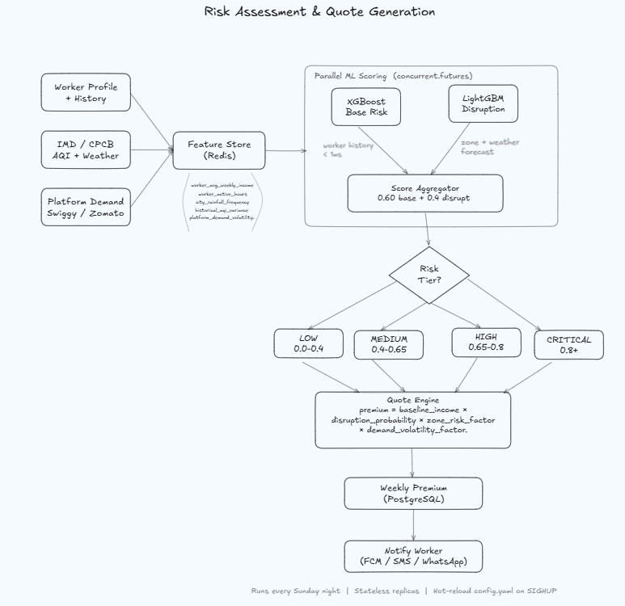
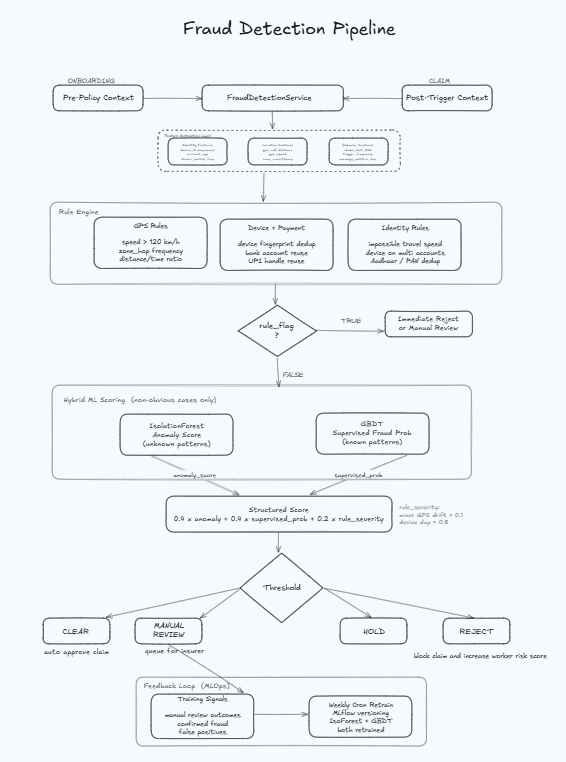
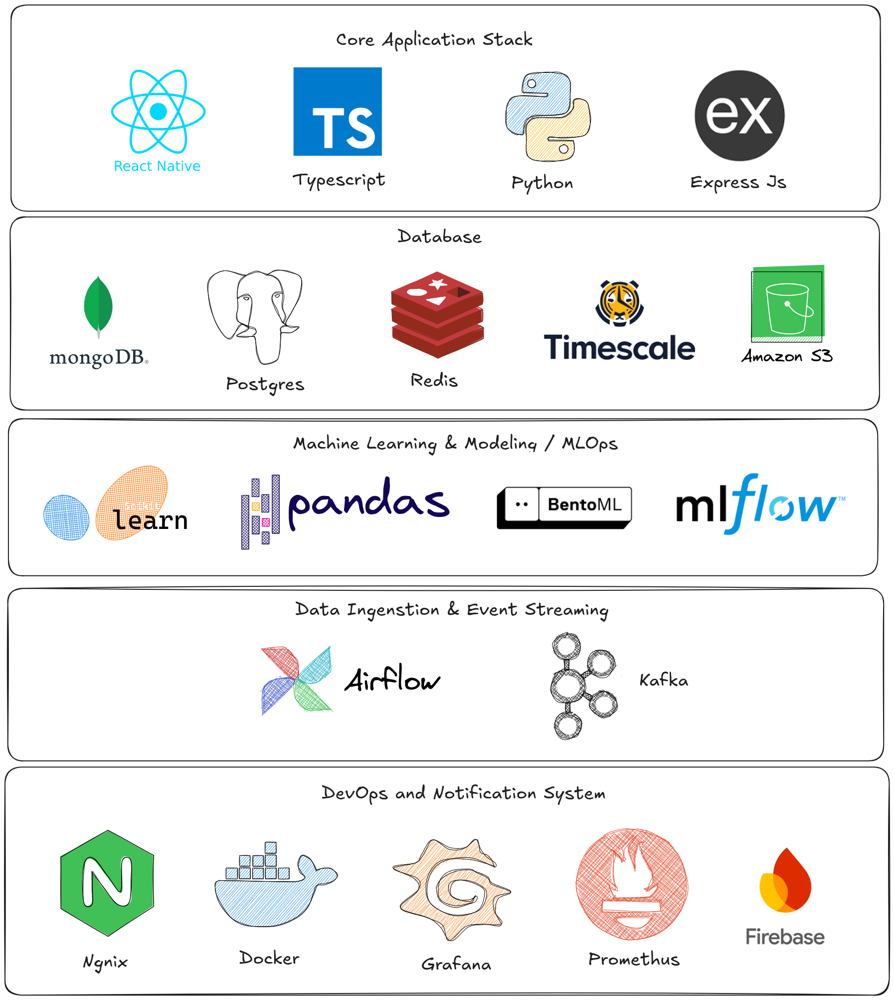

# Myrva

**AI-Powered Parametric Income Insurance for India's Gig Workers**

Myrva is a parametric insurance platform built for platform-based gig workers (Swiggy / Zomato delivery partners) in India. It provides automated, trigger-based income protection against external disruptions - extreme weather, hazardous air quality, and government-declared disasters - with no manual claims process and weekly pricing aligned to the gig work earnings cycle.

---

## Table of Contents
- [Problem Understanding](#problem-understanding)
- [Persona Definition](#persona-definition)
- [Policy Plan, Tiers & Event Coverage](#policy-plan-tiers--event-coverage)
- [Architecture Overview](#architecture-overview)
- [End-to-End Workflow](#end-to-end-workflow)
- [AI and ML Models](#ai-and-ml-models)
- [Adversarial Defense & Anti-Spoofing Strategy](#adversarial-defense--anti-spoofing-strategy)
- [Data Architecture](#data-architecture)
- [Development Plan](#development-plan)
- [Tech Stack](#tech-stack)
- [Team & Contributors](#team--contributors)

---

## Problem Understanding


A delivery worker’s job appears flexible, but their income is tightly tied to factors they don’t control. They don’t have a fixed salary, they earn only when they’re online, accepting orders, and completing deliveries. This makes their weekly income not just variable, but fragile.

Workers often plan expenses assuming steady daily earnings, but external factors like bad weather, pollution, or local restrictions can suddenly prevent them from working. The issue isn’t just a single lost day it’s the cumulative effect, where multiple missed days directly impact essentials like fuel, rent, and food, with no safety net.

Traditional insurance doesn’t address this gap, since there’s no physical damage or injury to claim. The loss remains invisible to insurers, even though it is immediate and critical for the worker.

As a result, gig workers face frequent income disruptions caused by external conditions, yet there’s no system to recognize or compensate for them. Any solution relying on manual claims or delays will fail, because the impact is immediate and short-term.

The core problem isn’t the absence of insurance itself, but the lack of a system that can detect disruptions in earning capacity in real time and compensate for them quickly and automatically.

---

## Persona Definition


**Delivery Partner (Swiggy / Zomato)**

This worker typically spends long hours online and earns only when orders are assigned and completed. Income is weekly, variable, and usually has very little buffer.

**How Income Breaks**

In practice, earnings depend on three things working together: being online, getting orders, and being able to move on roads safely. 

If weather, AQI, restrictions, or demand drops interrupt any one of these, income falls immediately.

**Why It Matters**

Even a short disruption window can severely affect take-home pay, while fuel, rent, and food expenses continue. 

The key point for Myrva is simple: this is not job loss, it is temporary income disruption. That is why coverage is designed for fast, trigger-based payouts.

---

## Policy Plan, Tiers & Event Coverage

### Policy Plan

**One plan** - `Delivery Partner Income Shield`. Workers enroll for a **2 month window** and pay **week by week**.

### Weekly Premium Calculation

The weekly premium is computed dynamically every week using the following model:

**Step 1 - Loss Fraction** (composite disruption risk for the week):

$$L_f = 1 - \prod_{i=1}^{n}(1 - P_i \times S_i)$$

**Step 2 - Final Weekly Premium:**

$$Pr_{final} = (E_w \times L_f \times C_t) \times (1 + M)$$

| Variable | Meaning |
|---|---|
| `Pᵢ` | Probability of disruption `i` occurring in the worker's zone this week - fetched from weather / AQI / govt APIs |
| `Sᵢ` | Severity of disruption `i` - based on frequency and timing (e.g., an event during 12–3 PM peak causes ~40% income loss vs. off-peak) |
| `Eᵥᵥ` | Worker's expected weekly earnings baseline (from platform activity history) |
| `Cₜ` | Coverage tier factor - the income replacement % for the selected tier (Basic / Standard / Premium) |
| `M` | Risk pool margin - ensures platform sustainability and covers correlated catastrophic events |

**Setting `Cₜ` and `M`:** Treated as a constrained optimisation problem. Monte Carlo simulations over historical weather and disruption patterns balance maximum market competitiveness (higher `Cₜ`) against the ruin probability of the risk pool - ensuring sufficient surplus to cover claims without exhausting capital reserves.

### Policy Tiers

| Tier | Covered Events | Who It's For |
|---|---|---|
| **Basic** | Severe weather (Rain, Flood, Extreme Heat) | Workers wanting minimal, essential protection |
| **Standard** | Basic + Air Quality (AQI) events | Full-time workers in metro zones |
| **Premium** | Standard + Government-declared disruptions | Workers in high-risk zones or high-earnings weeks |

### Coverage by Tier

| Disruption | Category | Basic | Standard | Premium |
|---|---|:---:|:---:|:---:|
| Heavy Rain | Environmental | ✅ | ✅ | ✅ |
| Flood | Environmental | ✅ | ✅ | ✅ |
| Extreme Heat | Environmental | ✅ | ✅ | ✅ |
| Hazardous AQI | Environmental | ❌ | ✅ | ✅ |
| Severe AQI | Environmental | ❌ | ✅ | ✅ |
| Government Curfew | Social | ❌ | ❌ | ✅ |
| NDMA Disaster | Social | ❌ | ❌ | ✅ |
| Local Strike | Social | ❌ | ❌ | ✅ |
| Zone Closure | Social | ❌ | ❌ | ✅ |

> **Not covered (all tiers):** Vehicle repair, fuel costs, device damage, platform-side order cancellations, personal illness.

### Data Sources

| Source | Trigger | Link |
|---|---|---|
| India Meteorological Department (IMD) | Rain, Flood, Extreme Heat, Heatwave | [mausam.imd.gov.in](https://mausam.imd.gov.in/imd_latest/contents/api.pdf) |
| OpenWeather API | Weather signals (supplementary) | [openweathermap.org](https://openweathermap.org/guide) |
| OpenAQ API | AQI - Hazardous / Severe levels | [docs.openaq.org](https://docs.openaq.org/) |
| India Open Data Portal | Government alerts, zone data | [data.gov.in](https://www.data.gov.in/) |
| MOSDAC (ISRO) | Satellite weather, flood monitoring | [mosdac.gov.in](https://www.mosdac.gov.in/) |
| India Water Resources (FFS) | Flood / river level data | [ffs.india-water.gov.in](https://ffs.india-water.gov.in/) |
| Google Routes API | Traffic, road closures, strike impact | [developers.google.com](https://developers.google.com/maps/documentation/routes) |
| NDMA | Disaster declarations, curfew alerts | [ndma.gov.in](https://ndma.gov.in) |
| Platform API (Swiggy / Zomato) | Zone closures, demand drop signals | Simulated |

---

## Architecture Overview



The system is composed of the following logical layers:

| Component | Responsibility |
|---|---|
| API Gateway | Routing, JWT auth, rate limiting |
| Identity Service | Aadhaar/PAN/OTP verification, face + device verification |
| Worker Profile Service | City, zone, platform, activity signals |
| Policy Service | Coverage activation, weekly premium calculation, risk pool booking |
| Worker Activity & Earnings Service | Delivery counts, hours online, weekly baseline income (via platform API) |
| Data Ingestion & Normalisation Layer | External feed aggregation and normalisation |
| Parametric Trigger Engine | Zone-level threshold evaluation, Kafka event publishing |
| Claim Engine | Eligibility check, policy validation, payout calculation |
| Fraud Detection Service | GPS spoof detection, biometric identity checks |
| AI Risk Engine | Risk scoring (XGBoost), premium pricing (LightGBM), disruption forecasting, fraud anomaly detection |
| Feature Store (Redis) | Low-latency access to risk scores, earnings features, weather signals, location data |
| Payment Service | Razorpay / UPI payout execution |
| Notification Service | FCM push, SMS, WhatsApp delivery |
| Risk Pool Service | Premium and payout tracking, loss ratio calculation |
| Data Lake (S3) | Weather history, claim history, earnings logs for model training |

---

## End-to-End Workflow


### 1. Worker Onboarding

```
App Registration
  → Aadhaar / PAN Verification
  → Face + OTP Verification
  → UPI / Bank Linking
  → Platform Affiliation (Swiggy / Zomato)
  → Identity Approved?
      Yes → Worker Profile Created → Coverage Selection (Basic / Standard / Premium)
      No  → Rejected
```

Workers register through the mobile app, undergo KYC via Aadhaar/PAN and biometric face verification, link their payout account, and affirm their platform affiliation. Approved workers proceed to select a coverage tier.

### 2. Worker Profiling and Risk Setup

```
Activity History Ingestion
  → Earnings Analysis
  → City / Zone Risk Factor
  → AI Risk Model Scoring
  → Disruption Probability Calculation
  → Weekly Premium Calculated
  → Worker Accepts?
      Yes → Policy Activated
      No  → (exit)
```

The AI Risk Engine ingests historical delivery activity and earnings data, applies city and zone-level risk factors, and scores each worker using ML models. The output is a personalised weekly premium. Upon acceptance, the policy is activated.

### 3. Real-Time Disruption Monitoring

```
External Data Sources (ingested continuously):
  - Weather APIs (IMD)
  - AQI (CPCB)
  - Traffic / Road Alerts
  - Government Disaster Alerts (NDMA)
  - Platform Demand Drop (Swiggy / Zomato feed)

  → Data Normalisation Engine
  → Parametric Trigger Engine - Threshold Detection via Kafka Event Stream

Trigger thresholds (examples):
  - Rainfall > 60mm in 24h
  - AQI > 300 (Hazardous)
  - Curfew / Heatwave declared
```

When a disruption threshold is breached in a zone, a `DisruptionEvent` is published to the Kafka event bus. The time-series data (weather readings, AQI, GPS logs, zone trigger history) is stored in TimescaleDB for audit and model training.

### 4. Fraud Detection and Claim Automation

```
Disruption Event Detected
  → Eligibility Check (policy active, worker in affected zone)
  → Fraud Detection Engine
      Fraud Detected?
          Yes → Flagged / Manual Review
          No  → Claim Auto Approved
                → Payout Calculated
                → Payment via Razorpay / UPI
                → Worker Notified (FCM / SMS / WhatsApp)
```

**Fraud signals evaluated:**
- GPS spoofing detection
- Duplicate identity patterns
- Impossible travel detection
- Suspicious payout history

All claim records (claimId, workerId, policyId, status, timestamp) are persisted in MongoDB.

### 5. Risk Pool Monitoring (Internal Loop)

```
Claim Stored in Data Warehouse (S3)
  → Loss Ratio Tracked
  → AI Model Updated
  → Risk Scores Updated
  → Premium Pricing Adjusted
  → Insurer Dashboard Updated
```

The Risk Pool Service continuously tracks the ratio of premiums collected to claims paid. This data flows back into the AI Risk Engine to recalibrate risk scores, update disruption probability models, and adjust future premium pricing - forming a closed feedback loop.

---

## AI and ML Models

| Model | Algorithm | Purpose |
|---|---|---|
| Risk Scoring | XGBoost | Predict individual worker risk based on zone, history, and platform activity |
| Premium Pricing | LightGBM | Dynamic weekly premium computation per worker profile |
| Disruption Forecasting | Time-series / regression | Forward-looking disruption probability for premium adjustment |
| Fraud Anomaly Detection | Isolation Forest / ensemble | Identify anomalous claim patterns before payout approval |

All models are served via the AI Risk Engine, which reads features from the Redis Feature Store and writes updated scores back for downstream consumption by the Policy and Claim services.

---

### Risk Assessment Pipeline



The risk assessment system estimates worker-level disruption risk and supports fair, adaptive weekly premium pricing.

1. **Context and feature ingestion**
Signals are collected from onboarding, worker activity, and external data streams, including city/zone risk, historical earnings volatility, disruption frequency, weather severity, AQI trends, and platform demand fluctuations.

2. **Data quality and normalization**
Raw inputs are validated, standardized, and time-aligned before modeling. Missing values, outliers, and inconsistent identifiers are handled to ensure scoring stability across workers and regions.

3. **Model-based risk estimation**
The scoring layer combines complementary models:
- **XGBoost** estimates individual risk based on worker behavior, location, and historical exposure.
- **Time-series / regression forecasting** projects near-term disruption probability at zone level.
- **LightGBM pricing model** translates risk outputs into premium-sensitive pricing inputs.

4. **Final risk score and pricing signal**
A calibrated risk score is generated from worker-level and zone-level predictions, then converted into a weekly pricing signal used by the Policy Service.

5. **Decision and policy application**
Based on the risk band, the platform applies premium recommendations, coverage constraints (if any), and internal risk-pool allocation logic for portfolio balance.

### Fraud Detection Pipeline



The fraud detection system filters invalid claims before payout using a layered approach that combines deterministic controls with machine learning.

1. **Context and feature extraction**
Signals are captured from both onboarding (pre-policy) and claim time (post-trigger), including location traces, device fingerprints, identity attributes, payment linkage, and behavioral patterns.

2. **Rule-based validation (hard filters)**
Deterministic checks are applied first to catch clear fraud indicators, including GPS anomalies (impossible speed or location mismatch), device or payment duplication, and identity reuse (Aadhaar/PAN). Claims that fail hard rules are rejected or routed to manual review.

3. **ML-based scoring (non-obvious cases)**
For claims that pass hard filters, a hybrid ML layer evaluates subtler risk:
- **Isolation Forest** identifies anomalous behavior not seen in historical normal patterns.
- **GBDT** - Gradient Boosted Decision Trees, estimates supervised fraud probability from labeled outcomes.


4. **Decision layer**
Operational actions are mapped from the final score:
- `Clear`: auto-approve for payout.
- `Manual Review`: escalate to insurer investigation.
- `Hold`: temporarily block pending additional checks.
- `Reject`: deny the claim.

5. **Continuous learning**
The model is continuously improved using manual-review outcomes, confirmed fraud cases, and false-positive analysis to increase precision while reducing unnecessary escalations.


## Adversarial Defense & Anti-Spoofing Strategy


To defend against coordinated GPS spoofing attacks, Myrva does not trust raw location alone. We treat every payout decision as a **multi-signal integrity problem** across behavior, device, network, and event context.

### 1. The Differentiation - Real Worker vs Spoofer

The decision engine combines a deterministic rule layer with an ML risk layer to separate genuinely stranded workers from synthetic claim behavior:

- **Behavior continuity check:** A real partner typically shows natural session flow (online duration, order accept/reject cadence, route evolution, pause patterns). Spoof rings often show static or jumpy traces with weak activity continuity.
- **Kinematic plausibility check:** We validate speed, acceleration, heading changes, and path smoothness. Impossible travel or repeated teleport-like jumps are high-confidence fraud indicators.
- **Device integrity check:** We score emulator/root/jailbreak indicators, mock-location flags, sensor consistency, and app-signature integrity. A mismatch between claimed movement and on-device sensor evidence raises risk sharply.
- **Event alignment check:** Genuine disruption claims correlate with zone-level impact (weather severity, road blocks, demand shock, nearby worker patterns). Isolated claims with no local corroboration are treated as suspicious.
- **Ring-level coordination check:** We detect synchronized anomalies (many users claiming from identical coordinates/IP ranges/device families within narrow windows), which strongly indicates organized fraud.

The output is a calibrated `Fraud Score (0-1)` used with policy eligibility checks before payout.

### 2. The Data - Signals Beyond Basic GPS

To detect sophisticated spoofing campaigns, the fraud pipeline analyzes cross-layer features:

- **Device and app trust:** OS build fingerprints, emulator signals, root/jailbreak status, mock-location status, app attestation results, app signature validity.
- **Motion and sensor telemetry:** accelerometer/gyroscope consistency, jitter profile, heading change entropy, stop-go rhythm, route smoothness.
- **Network intelligence:** IP subnet reputation, carrier consistency, cell-tower triangulation, VPN/proxy indicators, sudden IP/device switching.
- **Platform activity context:** active orders, delivery attempts, acceptance timeline, session continuity, historical baseline vs current behavior.
- **Environmental corroboration:** weather API severity, local road conditions, curfew/disaster alerts, zone-level demand contraction.
- **Graph and linkage signals:** shared devices, reused payout accounts, clustered claim timing, repeated co-location patterns across many worker IDs.

These features are evaluated in both **real-time scoring** (claim-time defense) and **batch graph analytics** (ring discovery and model retraining).

### 3. The UX Balance - Protect Honest Workers While Blocking Fraud

Myrva uses progressive friction, not blanket rejection, so workers facing real disruption are not unfairly penalized.

- **Low risk:** auto-approve and payout immediately.
- **Medium risk:** soft hold with fast recheck (additional passive telemetry + short retry window).
- **High risk:** manual review with priority SLA and clear reason code.
- **Critical risk:** reject and block when multiple high-confidence fraud signals agree.

For worker fairness, we apply the following safeguards:

- **No single-signal denial:** a network drop or GPS glitch alone cannot trigger hard rejection.
- **Explainable outcomes:** workers see plain-language status (`Approved`, `Recheck in progress`, `Manual review`) and next expected timeline.
- **Appeal + recovery path:** legitimate workers can complete lightweight re-verification without restarting policy enrollment.
- **False-positive control loop:** manual-review outcomes feed back into threshold tuning to reduce unnecessary escalations over time.

This keeps the liquidity pool protected against organized spoofing while ensuring genuine delivery partners continue to receive fast, fair payouts during real disruptions.
 
## Data Architecture


---

## Development Plan

The Development Plan is Linked to [Development Plan](./TODO.md)


## Tech Stack



**Databases**

| Store | Purpose |
|---|---|
| PostgreSQL | Worker profiles, policy records, identity data |
| TimescaleDB (PostgreSQL extension) | Time-series storage for weather readings, AQI, GPS logs, zone trigger history |
| PostGIS (PostgreSQL extension) | Geospatial queries - zone-based eligibility, GPS validation |
| MongoDB | Worker activity logs, claim records |
| Redis (Feature Store) | Real-time ML feature serving - risk scores, earnings data, weather features, location signals |
 
- Chose React Native to enable real-time, location-aware interactions (GPS, notifications) and provide a more reliable, performant experience for workers compared to a web app.

---

## Team & Contributors

Built with purpose and late nights by the Myrva team for **Guidewire DEVTrails 2026**.

| | | | | |
|:---:|:---:|:---:|:---:|:---:|
| [](https://github.com/Karthick-1905) | [](https://github.com/yesh-045) | [](https://github.com/SuryaNarayanaa) | [](https://github.com/Dhaarun-Abhimanyu) | [](https://github.com/Surya0265) |
| [Karthick J S](https://github.com/Karthick-1905) | [Yeshwanth S](https://github.com/yesh-045) | [Surya Narayanaa N T](https://github.com/SuryaNarayanaa) | [Dhaaru Abhimanyu S](https://github.com/Dhaarun-Abhimanyu) | [Surya Prakash B](https://github.com/Surya0265) |

---
